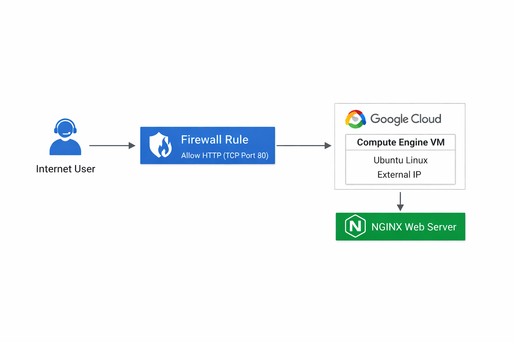
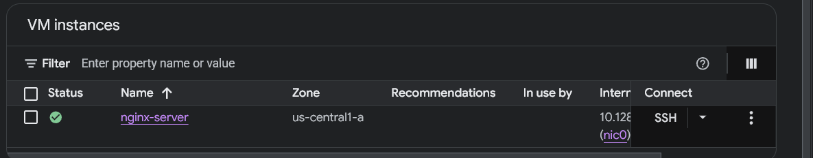
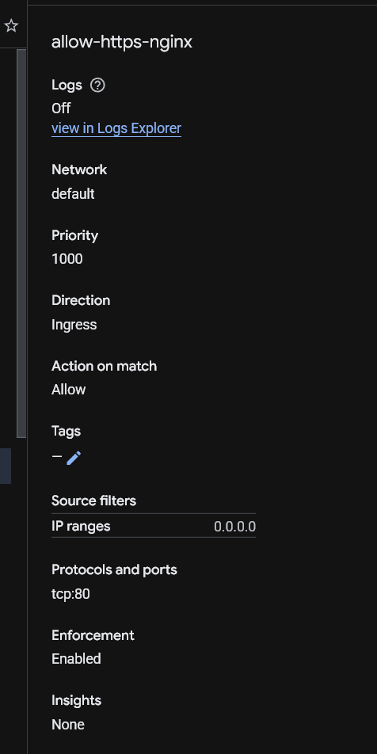
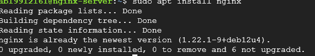
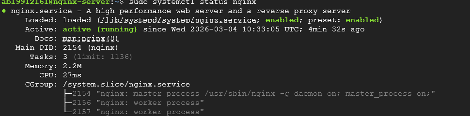
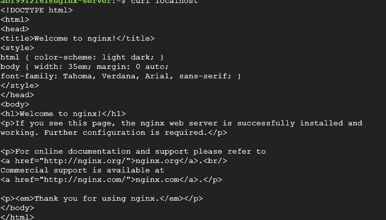
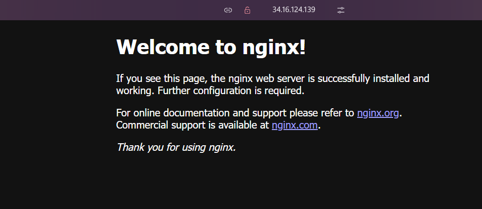

# GCP NGINX Web Server Deployment with Firewall Rules

## Project Overview

This project demonstrates how to deploy an **NGINX web server on a Google Cloud Compute Engine VM** and configure **VPC firewall rules** to allow HTTP traffic from the internet.

The web server runs on an **Ubuntu Linux VM**, and users can access it through the VM’s **external IP address**.

---

## Architecture



Internet → Firewall Rule (Allow TCP:80) → Compute Engine VM → NGINX Web Server

---

## Services Used

* Google Cloud Compute Engine
* VPC Network
* Firewall Rules
* Ubuntu Linux
* NGINX Web Server
* SSH

---

## Implementation Steps

### 1. Create VM Instance

A VM instance was created with the following configuration:

Name: nginx-server
Machine type: e2-micro
Region: us-central1
Boot disk: Ubuntu Linux

📷 Screenshot



---

### 2. Create Firewall Rule

Firewall rule created to allow HTTP traffic.

Configuration:

Direction: Ingress
Source IP Range: 0.0.0.0/0
Protocol: TCP
Port: 80

📷 Screenshot



---

### 3. Connect to VM Using SSH

The VM was accessed using **Google Cloud SSH terminal**.

📷 Screenshot



---

### 4. Install NGINX

Commands used:

```
sudo apt update
sudo apt install nginx -y
```

📷 Screenshot


---

### 5. Verify NGINX Running

```
sudo systemctl start nginx
sudo systemctl enable nginx
sudo systemctl status nginx
```

📷 Screenshot



---

### 6. Test Web Server with Curl

```
curl localhost
```

📷 Screenshot



---

### 7. Access Web Server from Browser

Open the VM **external IP** in a browser:

```
http://EXTERNAL-IP
```

📷 Screenshot



---

## Commands Used

```
sudo apt update
sudo apt install nginx -y
sudo systemctl start nginx
sudo systemctl enable nginx
sudo systemctl status nginx
curl localhost
```

---

## Skills Demonstrated

* Google Cloud Compute Engine
* VPC Networking
* Firewall Configuration
* Linux Server Administration
* Web Server Deployment
* Cloud Troubleshooting

---

## Author

Sravan A L
B.Tech CSE (IoT)
Manipal University Jaipur
Aspiring Cloud / DevOps Engineer
